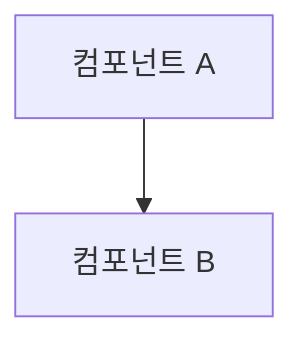

<!--
제목 형식: <type>(<scope>): <한국어 제목 (72자 이내)>

<type>:
  - feat: 새로운 기능 추가
  - fix: 버그 수정
  - refactor: 코드 리팩토링 (기능 변경 없음)
  - docs: 문서만 변경
  - test: 테스트 추가/수정
  - perf: 성능 개선
  - style: 코드 포맷, 스타일 변경 (로직 변경 없음)
  - ci: CI/CD 설정 변경
  - chore: 빌드 프로세스, 도구 설정 등

<scope> (변경 영역):
  - 플랫폼: frontend, backend
  - 비즈니스: analysis, detection, translation
  - 데이터: db, models, api
  - UI: ui, theme, i18n
  - 연동: openai, sentry
  - 배포: docker, deploy, config, workflow
  - 기타: deps, service
-->

사용자 관점에서 무엇이 달라지는지 한 문장으로 요약하고 중요한 키워드를 **볼드** 처리합니다.

---

## 🎯 목적

<!-- 이 변경이 왜 필요한지, 어떤 문제를 해결하는지 쉬운 단어로 구체적이고 명확하게 설명 -->

---

## 📦 주요 개선 사항

<!-- 사용자 경험과 기능 관점에서 무엇이 개선되는지 설명 -->
<!-- 유사한 내용을 묶어 하위 섹션으로 구성하고 각 항목 앞에 이모티콘 추가 -->
<!-- 삭제된 기능도 모두 설명 -->

### 🔧 [카테고리명]

---

## 🔍 구조 변경

<!-- 선택적: 주요 모듈 및 클래스를 tree로 구조화 -->
<!-- 핵심 구조는 Mermaid 다이어그램으로 시각화 -->
<!-- Mermaid에서 괄호와 같은 특수 문자는 인용 부호(")로 감싸기 -->

---

## ✅ 테스트 체크리스트

<!-- 사용자 관점에서 실제로 동작을 확인할 수 있는 시나리오를 체크박스 스타일로 작성 -->
<!-- 기술적 테스트 항목이 아닌, 기능과 사용자 경험 중심으로 -->

- [ ] 시나리오 1
- [ ] 시나리오 2

### 기술 검증
- [ ] `cd backend && make lint`
- [ ] `cd backend && make type-check`
- [ ] `cd backend && make unit-test`
- [ ] `cd frontend && npm run lint`
- [ ] `cd frontend && npm run type-check`
- [ ] `cd frontend && npm test`

---

## 🎨 개선 효과

<!-- 개발자가 아니어도 이해하기 쉽게 케이스별로 설명 -->

### 케이스 1:
